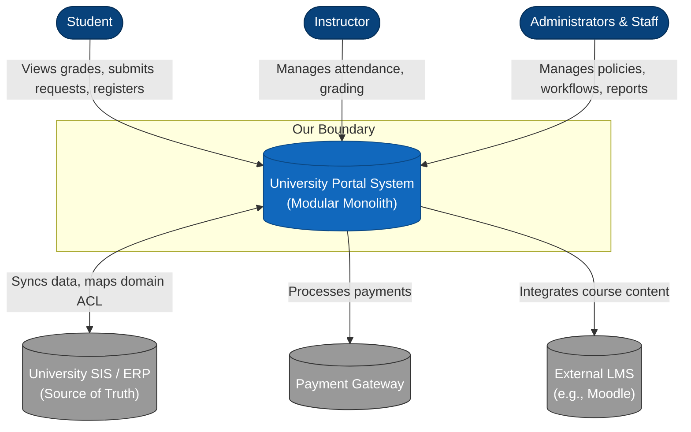

# Target Architecture

This document describes the target state architecture of the university system, transitioning from a highly cohesive ball of mud to a **Modular Monolith** based on Domain-Driven Design (DDD) principles.

The system acts as a **Consumer/Orchestrator** over a central University Student Information System (SIS/ERP), maintaining local projections and driving value-add workflows.

---

## 1. System Context Diagram (Level 1)

This diagram illustrates how our system fits into the broader university ecosystem, interacting with end users and external systems.

---

## 2. Container Diagram (Level 2)

This diagram zooms into the **University Portal System** to show its high-level technical containers.

---

## 3. Comprehensive Modular Data Flow & Domain Diagram (Level 3+)

This diagram details the deep internal structure of the **Modular Monolithic Backend**. It captures:
1. All distinct **user roles** (Student, Instructor, Student Affairs, System Admin, Finance).
2. Their interactions with specific **portals/gateways**.
3. The routing of their requests to proper **Bounded Contexts** (Core, Supporting, Optional).
4. The crucial **data flow from the external SIS** down into local projection databases, managed by the **Integration Layer (ACL)**.

```mermaid
flowchart TD

    %% ----------------------------------------------------
    %% EXTERNAL SYSTEMS (Source of Truth)
    %% ----------------------------------------------------
    subgraph ExternalEcosystem [External Systems]
        SIS[("Central SIS / ERP\n(Master Data)")]
        PaymentGtwy["Payment Gateway"]
    end

    %% ----------------------------------------------------
    %% USERS & PORTALS
    %% ----------------------------------------------------
    subgraph EndUsers [User Roles]
        R_Student([Student])
        R_Instructor([Instructor])
        R_StudentAffairs([Student Affairs])
        R_SysAdmin([System Admin])
        R_Finance([Finance Officer])
    end

    subgraph Portals [User Interfaces / API Gateway]
        UI_Student["Student Portal"]
        UI_Staff["Staff / Faculty Portal"]
        UI_Admin["Admin & Management Portal"]
    end

    %% Map Users to Portals
    R_Student --> UI_Student
    R_Instructor --> UI_Staff
    R_StudentAffairs --> UI_Admin
    R_Finance --> UI_Admin
    R_SysAdmin --> UI_Admin

    %% ----------------------------------------------------
    %% DATA LAYER
    %% ----------------------------------------------------
    subgraph DataLayer [Local Data Store]
        LocalDB[("Local Projection DB\n& Workflow State")]
    end

    %% ----------------------------------------------------
    %% BACKEND: MODULAR MONOLITH
    %% ----------------------------------------------------
    subgraph ModularBackend [Modular Monolith: Bounded Contexts]

        %% INTEGRATION CORE (ACL)
        subgraph Core_Integration [🔴 Integration & Sync: Execution Core]
            ACL_Sync["SIS Sync / ETL Engine"]
            ACL_Mapper["Domain Mapper: ACL"]
        end

        %% IAM CORE
        subgraph Core_IAM [🔴 Identity & Access: Execution Core]
            Mod_Auth["Authentication & SSO"]
            Mod_RBAC["Role & Permissions Engine"]
            Mod_UserProfile["Local User Profiles"]
        end

        %% WORKFLOW CORE
        subgraph Core_Workflow [🔴 Requests & Workflows: Execution Core]
            Mod_Engine["Workflow Engine: Approvals, SLAs"]
            Mod_StudentReq["Student Requests: Certificates, Appeals"]
        end

        %% UPSTREAM PROJECTIONS
        subgraph Upstream_Domains [🟠 Upstream Projections: Academic & Enrollment]
            Mod_Catalog["Academic Catalog (Programs, Courses)"]
            Mod_Enrollment["Enrollment & Registration"]
            Mod_Finance["Fee & Balance Management"]
        end

        %% SUPPORTING DOMAINS
        subgraph Support_Domains [🟡 Supporting Domains: Teaching & Operations]
            Mod_Grading["Grading & Assessment"]
            Mod_Attendance["Attendance Tracking"]
            Mod_Schedule["Timetable & Scheduling"]
            Mod_Advising["Advising & Graduation"]
        end

        %% OPTIONAL DOMAINS
        subgraph Optional_Domains [⚪ Optional / Cross-Cutting Domains]
            Mod_Notify["Notifications (Email/SMS)"]
            Mod_Reports["Reporting & Analytics"]
            Mod_Docs["File & Document Management"]
        end
    end

    %% ----------------------------------------------------
    %% DATA FLOWS & RELATIONSHIPS
    %% ----------------------------------------------------

    %% SIS Integration Flow (The Backbone)
    SIS -->|Pulls Raw Data| ACL_Sync
    ACL_Sync -->|Transforms| ACL_Mapper
    ACL_Mapper -->|Updates Local Read Models| Mod_Catalog
    ACL_Mapper -->|Updates Local Read Models| Mod_Enrollment
    ACL_Mapper -->|Updates Local Read Models| Mod_Finance
    ACL_Mapper -->|Updates User Base| Mod_UserProfile

    %% DB Persistence
    Core_Integration -->|Writes| LocalDB
    Core_IAM -->|Reads/Writes| LocalDB
    Core_Workflow -->|Reads/Writes| LocalDB
    Upstream_Domains -->|Reads| LocalDB
    Support_Domains -->|Reads/Writes| LocalDB
    Optional_Domains -->|Reads/Writes| LocalDB

    %% Portal routing to modules (Feature mapping)
    UI_Student -->|Views Academics| Mod_Catalog
    UI_Student -->|Registers| Mod_Enrollment
    UI_Student -->|Submits Requests| Mod_StudentReq
    UI_Student -->|Pays Fees| Mod_Finance

    UI_Staff -->|Enters Grades| Mod_Grading
    UI_Staff -->|Marks Attendance| Mod_Attendance
    UI_Staff -->|Views Schedule| Mod_Schedule

    UI_Admin -->|Manages Workflows| Mod_Engine
    UI_Admin -->|Configures Roles| Mod_RBAC
    UI_Admin -->|Generates Reports| Mod_Reports

    %% Internal Module Dependencies (DDD Rules)
    Mod_StudentReq -->|Triggers| Mod_Engine
    Mod_Engine -->|Uses Roles| Mod_RBAC
    Mod_Enrollment -->|Checks Prerequisites| Mod_Catalog

    %% Optional Domain Event Hooks
    Mod_Engine -.->|Publishes Event| Mod_Notify
    Mod_Grading -.->|Publishes Event| Mod_Notify
    Mod_StudentReq -.->|Stores Attachments| Mod_Docs

    %% External Integrations
    Mod_Finance -->|Transactions| PaymentGtwy

    %% ----------------------------------------------------
    %% STYLING
    %% ----------------------------------------------------
    classDef core fill:#ffebee,stroke:#c62828,stroke-width:2px;
    classDef upstream fill:#fff3e0,stroke:#ef6c00,stroke-width:2px;
    classDef support fill:#fffde7,stroke:#fbc02d,stroke-width:2px;
    classDef optional fill:#f5f5f5,stroke:#9e9e9e,stroke-width:2px;
    classDef external fill:#e0e0e0,stroke:#616161,stroke-width:2px;
    classDef db fill:#2d5d8c,stroke:#1d3d5c,color:#fff,stroke-width:2px;

    class Core_Integration,Core_IAM,Core_Workflow core;
    class Upstream_Domains upstream;
    class Support_Domains support;
    class Optional_Domains optional;
    class SIS,PaymentGtwy external;
    class LocalDB db;

```

---

## Architectural Principles & Rules

1. **Dependency Direction**:
   - Supporting modules may depend on Core modules.
   - Core modules must **never** depend on Supporting or Optional modules.
   - Optional modules must act as isolated endpoints (often driven by domain events like `StudentEnrolledEvent`).
2. **Anti-Corruption Layer (ACL)**:
   - The system **must never trust external SIS data directly**. All external data passes through the Integration Layer, gets transformed, and is stored as a local projection in the database.
   - The local database is a *Projection* and *Workflow State Store*, not the ultimate source of truth for academic records.
3. **Eventual Consistency**:
   - Because the SIS is the source of truth for domains like `Academic Structure` and `Finance`, our system relies on scheduled syncing or event-driven updates.
4. **Resilience**:
   - If the `Notification` or `Reporting` modules fail, core operations like `StudentRequests` or `Enrollment` workflows must continue to function uninterrupted.
