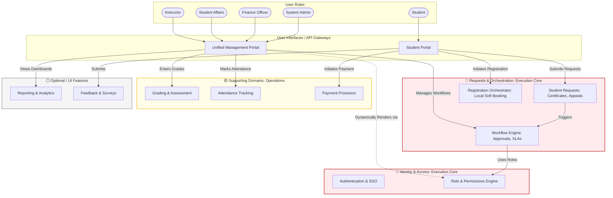
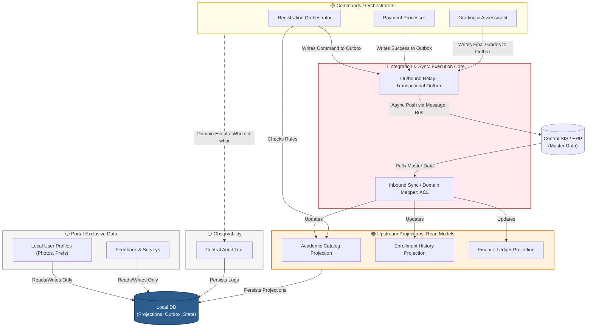

# Target Architecture

This document describes the target state architecture of the university system, transitioning from a highly cohesive ball of mud to a **Modular Monolith** based on Domain-Driven Design (DDD) principles.

The system acts as a **Consumer/Orchestrator** over a central University Student Information System (SIS/ERP), maintaining local projections and driving value-add workflows.

---

## 1. System Context Diagram (Level 1)

This diagram illustrates how our system fits into the broader university ecosystem, interacting with end users and external systems.

---

## 2. Container Diagram (Level 2)

This diagram zooms into the **University Portal System** to show its high-level technical containers.

---

## 3. Modular Internal Views (Level 3)

To prevent visual clutter ("the jungle of arrows") and strictly enforce boundary concepts, the detailed architecture is split into two bounded visual views:
* **Level 3A:** User UI to Execution Flow (Focuses on Portals, IAM, and Command Execution).
* **Level 3B:** Integration & Data Flow (Focuses on the CQRS Read/Write paths, Master Data Sync, and Portal-Owned State).

### Level 3A: User UI to Execution Flow

This view demonstrates how actors interact with unified portals, and how those portals interact with the Execution Core and Supporting Domains. Notice that Instructors, Finance, and Admins share a consolidated **Management Portal**, heavily relying on the **RBAC Engine** to hydrate their UI dynamically.

---

### Level 3B: Integration & Data Flow

This diagram illustrates the CQRS Data flow. It separates **Upstream Projections** (where SIS is the system of record) from **Portal-Owned State** (where the Local DB is the sole source of truth). It also illustrates the outbound write-back path utilizing the **Transactional Outbox**, and the system-wide **Audit Trail**.

---

## Architectural Principles & Rules

1. **Dependency Direction**:
   - Supporting modules may depend on Core modules.
   - Core modules must **never** depend on Supporting or Optional modules.
   - Optional modules must act as isolated endpoints (often driven by domain events like `StudentEnrolledEvent`).
2. **Anti-Corruption Layer (ACL)**:
   - The system **must never trust external SIS data directly**. All external data passes through the Integration Layer, gets transformed, and is stored as a local projection in the database.
   - The local database is a *Projection* and *Workflow State Store*, not the ultimate source of truth for academic records.
3. **Eventual Consistency**:
   - Because the SIS is the source of truth for domains like `Academic Structure` and `Finance`, our system relies on scheduled syncing or event-driven updates.
4. **Resilience**:
   - If the `Notification` or `Reporting` modules fail, core operations like `StudentRequests` or `Enrollment` workflows must continue to function uninterrupted.

## 4. Glossary & Terminology Reference

To ensure there is absolutely no ambiguity when reading these architectural diagrams, every concept, architectural pattern, and module is comprehensively defined below.

### 4.1 Core Architectural Patterns
* **Modular Monolith**: A software architecture style where a single deployable application is internally structured into strictly isolated, decoupled modules (Bounded Contexts). It provides the simplicity of a monolith with the organizational boundaries of microservices.
* **Domain-Driven Design (DDD)**: A software design approach focusing on modeling software to match a domain according to input from domain experts. It strictly defines the boundaries and relationships between different parts of the system.
* **Bounded Context**: A central pattern in DDD. It is a logical boundary within which a particular domain model is defined and applicable (e.g., the "Finance" context has a different definition of a "Student" than the "Grading" context).
* **Anti-Corruption Layer (ACL)**: A protective translation layer between two subsystems (in our case, the local Portal and the central SIS). It ensures that the Portal's internal domain models are not "corrupted" by the messy, legacy data structures of the upstream SIS.
* **CQRS (Command Query Responsibility Segregation)**: An architectural pattern that separates the data models used for reading data (Queries/Projections) from the data models used for updating data (Commands/Orchestrators).
* **Transactional Outbox**: A pattern used to guarantee reliable message delivery to external systems. Instead of directly calling an external API during a database transaction, the system writes a message to an "Outbox" table in the *same* local database transaction. A separate background worker reliably pushes this message to the external system (the SIS) later.
* **Saga / Soft Booking**: A pattern for managing distributed transactions. Instead of locking the central SIS database during enrollment, the portal "Soft Books" the seat locally (Process Manager) and asynchronously asks the SIS for final confirmation. If the SIS rejects it, the Saga executes a "Compensating Transaction" locally to roll back the soft booking.

### 4.2 System Boundaries & Classifications
* **Execution Core**: The absolute backbone of the portal system. If these modules fail, the portal fundamentally ceases to operate.
* **Upstream Projections**: Read-only replicas of data where the ultimate source of truth is owned by the central SIS. The portal consumes this data but does not own the master records.
* **Supporting Domains**: Modules that handle transactional operations, teaching execution, and daily university operations. They rely on the Core to function.
* **Optional / UI Features**: Plug-and-play modules. If these fail or are removed, the university's core operations continue uninterrupted (e.g., Notifications, Surveys).
* **Portal-Exclusive State**: Data that originates within the portal and lives there permanently. The central SIS has no knowledge of this data, and it is never synced back up.

### 4.3 Users & Actors
* **Student**: An end-user interacting with the portal to view their academic standing, register for courses, pay fees, and submit bureaucratic requests.
* **Instructor**: Teaching staff responsible for entering authoritative academic execution data, such as final grades and daily attendance.
* **Student Affairs**: Administrative staff responsible for processing student requests, handling appeals, and overseeing graduation requirements.
* **Finance Officer**: Staff responsible for overseeing tuition fee collections, managing discounts, and verifying payment transactions.
* **System Admin**: IT staff responsible for configuring the portal, managing role assignments (RBAC), and monitoring system health.

### 4.4 Portals (UI Gateways)
* **Student Portal**: The dedicated frontend UI tailored specifically for student workflows.
* **Unified Management Portal**: A consolidated frontend application shared by Instructors, Student Affairs, Finance, and Admins. Instead of separate apps, this portal hydrates its features dynamically based on the user's role and permissions.

### 4.5 The Modules (Bounded Contexts)

#### Integration Core
* **ACL_Inbound (SIS Sync / ETL Engine)**: The worker process responsible for securely pulling master data from the central SIS, mapping it to our portal's domain models, and caching it locally.
* **ACL_Outbound (Transactional Outbox Relay)**: The worker process responsible for securely delivering local write commands (like a processed payment or a registered course) back to the central SIS to ensure eventual consistency.

#### Identity & Access Core (IAM)
* **Mod_Auth (Authentication & SSO)**: Handles logging users in, verifying credentials, and issuing secure session tokens (JWTs).
* **Mod_RBAC (Role & Permissions Engine)**: The authoritative engine that determines exactly which features, buttons, and API endpoints a user is allowed to access based on their assigned role.
* **Mod_UserProfile**: Manages the local user profile state. While basic identity comes from the SIS, this module owns Portal-Exclusive data like profile photos, UI theme preferences, and emergency contact updates.

#### Orchestration & Workflow Core
* **Mod_Engine (Workflow Engine)**: A generic, highly configurable engine that manages bureaucratic processes. It tracks multi-level approval chains, enforces Service Level Agreements (SLAs), and manages the state of any generic request.
* **Mod_StudentReq (Student Requests)**: The specific domain handling student paperwork generation, such as printing enrollment certificates, requesting clearance, or filing grade appeals.
* **Mod_RegOrchestrator (Registration Orchestrator)**: The active Process Manager for course enrollment. It is responsible for validating prerequisites locally, temporarily "soft booking" a seat, and placing the final registration command into the Outbox to be sent to the SIS.

#### Upstream Projections (Read Models)
* **Mod_Catalog (Academic Catalog Projection)**: A read-only local cache of the university's faculties, departments, degree programs, and available courses for the semester.
* **Mod_EnrollmentHistory**: A read-only local cache of a student's past and officially confirmed current schedule.
* **Mod_FinanceProj**: A read-only local cache of a student's outstanding tuition balances and fee structures.

#### Supporting Domains
* **Mod_PaymentProc (Payment Processor)**: The active command module responsible for integrating with external Payment Gateways (like Stripe or PayPal), capturing funds, and writing the success receipt to the Outbox for SIS reconciliation.
* **Mod_Grading (Grading & Assessment)**: The module where instructors input midterm, coursework, and final grades.
* **Mod_Attendance**: The module for tracking daily student presence or absence in scheduled sections.
* **Mod_Schedule (Timetable)**: Handles the spatial and temporal allocation of courses—showing students and instructors when and in which room their classes occur.
* **Mod_Advising (Advising & Graduation)**: Provides tools for academic advisors to track student progress against degree audits and manage graduation clearance eligibility.

#### Optional / Cross-Cutting Domains
* **Mod_FeedbackSurveys**: A portal-exclusive module for gathering course evaluations or general student feedback. The SIS does not care about this data.
* **Mod_Notify (Notifications)**: A centralized module that listens for domain events (e.g., "Request Approved") and dispatches Emails, SMS, or In-App push notifications.
* **Mod_Reports (Reporting & Analytics)**: Aggregates data from across the local database to provide visual dashboards and exportable reports for management.
* **Mod_Docs (File & Document Management)**: An abstraction layer for handling file uploads, such as scanned national IDs or submitted medical exemption PDFs, storing them in local storage or cloud buckets (like AWS S3).
* **Mod_AuditTrail (Central Audit Trail)**: A strict compliance module that silently listens to all actions taken by users across the system (e.g., "Admin X changed Student Y's grade at 10:00 AM") and logs them in an immutable format.
