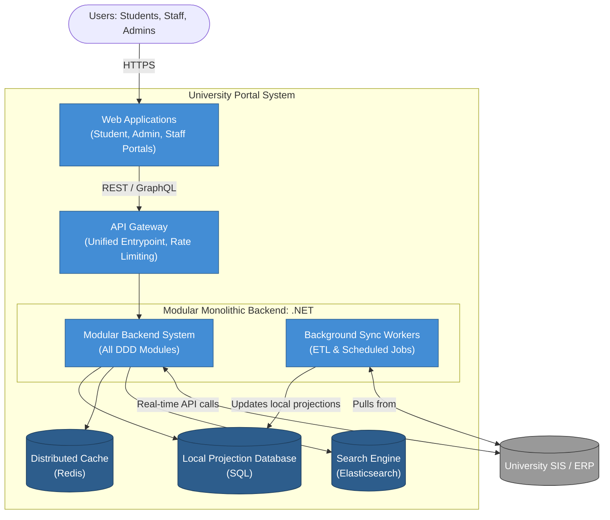
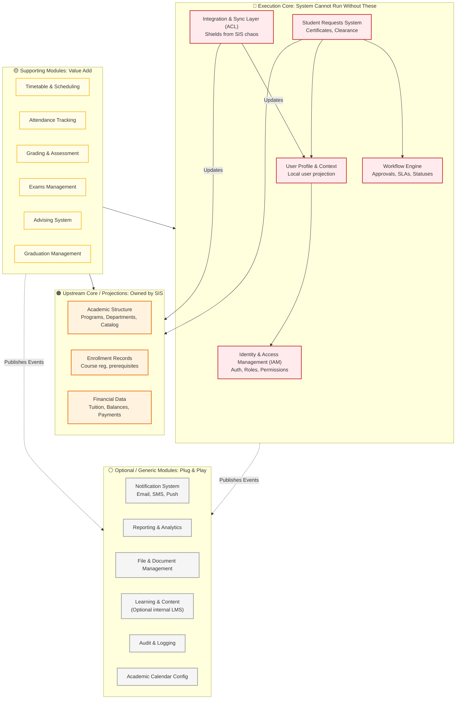

# Target Architecture

This document describes the target state architecture of the university system, transitioning from a highly cohesive ball of mud to a **Modular Monolith** based on Domain-Driven Design (DDD) principles.

The system acts as a **Consumer/Orchestrator** over a central University Student Information System (SIS/ERP), maintaining local projections and driving value-add workflows.

---

## 1. System Context Diagram (Level 1)

This diagram illustrates how our system fits into the broader university ecosystem, interacting with end users and external systems.

---

## 2. Container Diagram (Level 2)

This diagram zooms into the **University Portal System** to show its high-level technical containers.

---

## 3. Component / Module Diagram (Level 3)

This diagram details the internal structure of the **Modular Monolithic Backend**. It classifies the modules according to Domain-Driven Design into Core, Upstream Core, Supporting, and Optional domains.

* **Execution Core**: The absolute backbone of this orchestrator system. The system dies without these.
* **Upstream Core (Read-Only Projections)**: Core to the university, but owned by the SIS. We maintain local projections of these.
* **Supporting/Value-Add Modules**: Modules that enhance the university experience (workflows, portals).
* **Optional/Generic Modules**: Plug-and-play functionalities.

---

## Architectural Principles & Rules

1. **Dependency Direction**:
   - Supporting modules may depend on Core modules.
   - Core modules must **never** depend on Supporting or Optional modules.
   - Optional modules must act as isolated endpoints (often driven by domain events like `StudentEnrolledEvent`).
2. **Anti-Corruption Layer (ACL)**:
   - The system **must never trust external SIS data directly**. All external data passes through the Integration Layer, gets transformed, and is stored as a local projection in the database.
   - The local database is a *Projection* and *Workflow State Store*, not the ultimate source of truth for academic records.
3. **Eventual Consistency**:
   - Because the SIS is the source of truth for domains like `Academic Structure` and `Finance`, our system relies on scheduled syncing or event-driven updates.
4. **Resilience**:
   - If the `Notification` or `Reporting` modules fail, core operations like `StudentRequests` or `Enrollment` workflows must continue to function uninterrupted.
